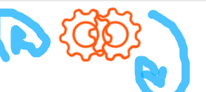

# 1.Loaders
Un loader est une animation qui indique aux internautes que leur requête est en train d'être traitée. L'animation s'affiche jusqu'à ce que les éléments finissent d'être chargés. Le loader conforte l'utilisateur, et le fait patienter agréablement. HTML et CSS permettent de programmer un loader sur son site web.

## L1. Spinner:
### Animated Loader Component for React
1. First, create a new file `Loader.tsx:

```tsx
import React from "react";
import "./Loader.css"; // We'll create this next

const Loader = () => {
  return (
    <div className="loader-container">
      <div className="loader">
        <div className="loader-dot"></div>
        <div className="loader-dot"></div>
        <div className="loader-dot"></div>
        <div className="loader-dot"></div>
        <div className="loader-dot"></div>
      </div>
      <p className="loader-text">Chargement en cours...</p>
    </div>
  );
};

export default Loader;
```

## 2. Create the accompanying CSS file `Loader.css`:

```css
.loader-container {
  display: flex;
  flex-direction: column;
  align-items: center;
  justify-content: center;
  height: 100vh;
  gap: 20px;
}

.loader {
  display: flex;
  gap: 8px;
}

.loader-dot {
  width: 12px;
  height: 12px;
  border-radius: 50%;
  background-color: #3b82f6; /* Tailwind blue-500 */
  animation: bounce 1.4s infinite ease-in-out both;
}

.loader-dot:nth-child(1) {
  animation-delay: -0.32s;
}

.loader-dot:nth-child(2) {
  animation-delay: -0.16s;
}

.loader-text {
  color: #4b5563; /* Tailwind gray-600 */
  font-size: 1rem;
  font-weight: 500;
}

@keyframes bounce {
  0%, 80%, 100% { 
    transform: scale(0);
    opacity: 0.5;
  }
  40% { 
    transform: scale(1);
    opacity: 1;
  }
}
```

## 3. Usage in your Familles component:

First import the loader:
```tsx
import Loader from "../../components/Loader";
```

Then replace your loading return with:
```tsx
if (loading) {
  return <Loader />;
}
```

# Alternative Loader Options

## L2. Spinner Loader (simpler version):
```tsx
const SpinnerLoader = () => (
  <div className="flex justify-center items-center h-screen">
    <div className="animate-spin rounded-full h-12 w-12 border-t-2 border-b-2 border-blue-500"></div>
  </div>
);
```


## L3. Progress Bar Loader:
```tsx
const ProgressLoader = () => (
  <div className="w-full h-2 bg-gray-200 rounded-full overflow-hidden">
    <div 
      className="h-full bg-blue-500 rounded-full animate-progress"
      style={{ animationDuration: '2s' }}
    ></div>
  </div>
);
```

Add this to your CSS for the progress bar:
```css
@keyframes progress {
  0% { width: 0%; }
  100% { width: 100%; }
}

.animate-progress {
  animation: progress linear infinite;
}
```


## L4 .GearLoader
### GearLoader.tsx
```tsx
import React from 'react';
import './GearLoader.css'; // Nous créerons ce fichier ensuite

const GearLoader = () => {
  return (
    <div className="loader-container">
      <div className="gear" id="gear1">
        
      </div>
      <div className="gear" id="gear2">
        
      </div>
    </div>
  );
};

export default GearLoader;
```

### GearLoader.css
```css
.loader-container {
  display: flex;
  justify-content: center;
  align-items: center;
  height: 100vh;
  position: relative;
}

.gear {
  width: 100px;
  height: 100px;
  position: absolute;
}

#gear1 {
  left: 44%;
  transform: translate(-50%, -50%);
  transform-origin: center;
  animation: rotate-clockwise 4s linear infinite;
}

#gear2 {
  left: 58%;
  transform: translate(-50%, -50%) rotate(10deg);
  transform-origin: center;
  animation: rotate-counterclockwise 4s linear infinite;
}

.gear img {
  width: 100%;
  height: 100%;
  filter: brightness(0) saturate(100%) invert(44%) sepia(92%) saturate(3154%) 
          hue-rotate(353deg) brightness(101%) contrast(101%);
}

@keyframes rotate-clockwise {
  from {
    transform: translate(-50%, -50%) rotate(0deg);
  }
  to {
    transform: translate(-50%, -50%) rotate(360deg);
  }
}

@keyframes rotate-counterclockwise {
  from {
    transform: translate(-50%, -50%) rotate(10deg);
  }
  to {
    transform: translate(-50%, -50%) rotate(-346deg);
  }
}
```
### Utilisation dans votre composant
```tsx
import GearLoader from './components/GearLoader';

// Version de base
<GearLoader />
```


